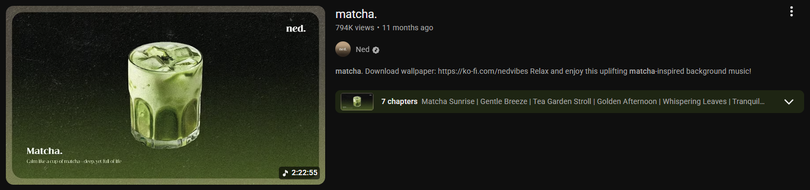
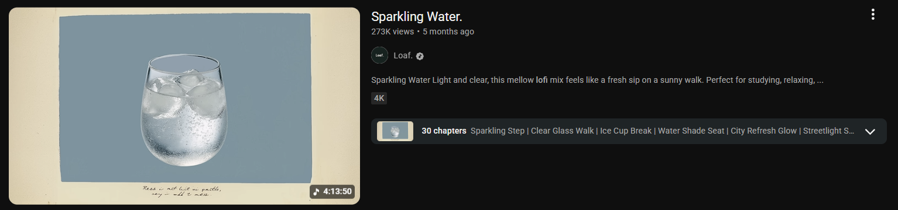
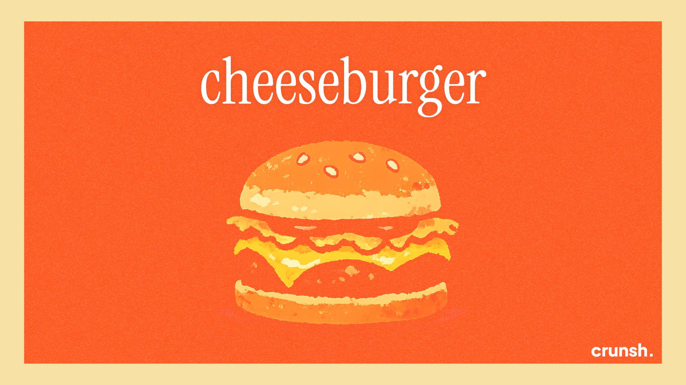

# Crunsh

**Generate on-demand lofi!**

## Inspiration

I was inspired from existing lofi channels that has a theme of food. So I automated my own with my twitst.

## Preview

## Workflow

1. User prompts the food theme for the video
2. Food image is generated via OpenAI's image model
3. Gemini generates a music plan prompt
4. The music plan prompt is fed to Suno AI
5. Video is composed using ffmpeg
